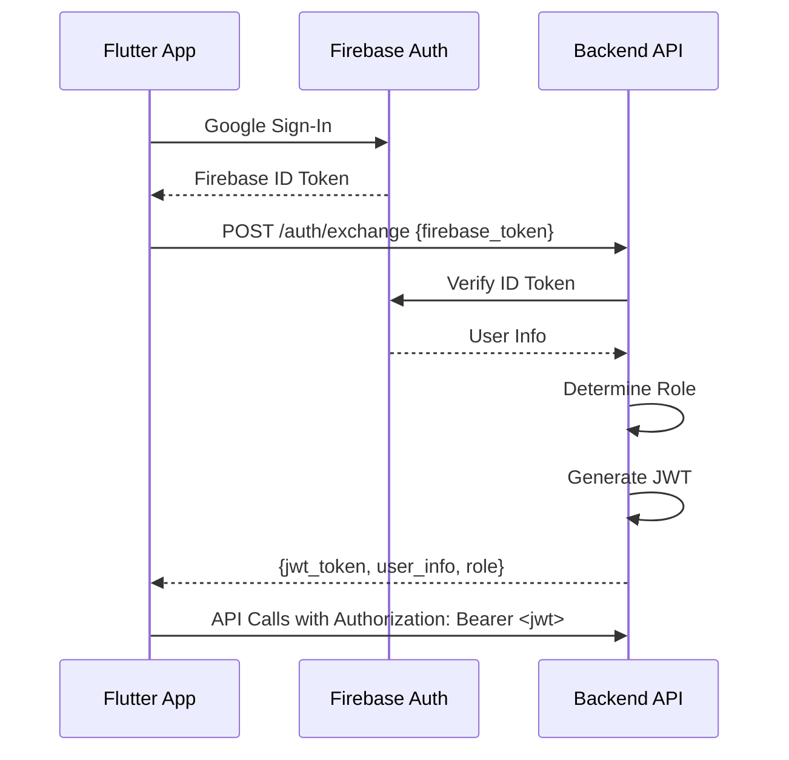

# Info Class Backend API

Firebase 인증과 JWT 기반 역할 관리를 제공하는 FastAPI 백엔드입니다.

## 🎯 주요 기능

- **Firebase 인증 통합**: Google Sign-In via Firebase Auth
- **JWT 토큰 관리**: 커스텀 JWT 토큰 생성 및 검증
- **역할 기반 접근 제어**: 관리자/학생 역할 구분
- **자동 API 문서화**: OpenAPI/Swagger 지원
- **CORS 및 보안**: 프론트엔드 연동을 위한 CORS 설정

## 🏗️ 아키텍처

```
backend/
├── main.py              # FastAPI 앱 진입점
├── requirements.txt     # Python 의존성
├── .env.example        # 환경변수 템플릿
├── config/
│   ├── settings.py     # 앱 설정
│   └── firebase_config.py # Firebase Admin SDK 설정
├── auth/
│   ├── models.py       # Pydantic 모델
│   ├── firebase_validator.py # Firebase 토큰 검증
│   ├── jwt_manager.py  # JWT 생성/검증
│   └── role_manager.py # 역할 결정 로직
├── api/
│   └── auth_routes.py  # 인증 API 엔드포인트
└── middleware/
    ├── cors.py         # CORS 설정
    └── error_handler.py # 글로벌 에러 처리
```

## 🚀 빠른 시작

### 1. 의존성 설치

```bash
cd backend
pip install -r requirements.txt
```

### 2. 환경 변수 설정

```bash
cp .env.example .env
# .env 파일을 편집하여 실제 값으로 설정
```

필수 환경 변수:
- `SECRET_KEY`: JWT 서명용 비밀키 (openssl rand -hex 32로 생성)
- `FIREBASE_PROJECT_ID`: Firebase 프로젝트 ID
- `FIREBASE_SERVICE_ACCOUNT_PATH`: Firebase 서비스 계정 키 파일 경로

### 3. Firebase 서비스 계정 설정

1. Firebase Console에서 프로젝트 설정 → 서비스 계정
2. "새 비공개 키 생성" 클릭하여 JSON 파일 다운로드
3. 다운로드한 파일 경로를 `FIREBASE_SERVICE_ACCOUNT_PATH`에 설정

### 4. 서버 실행

```bash
# 개발 모드 (핫 리로드)
uvicorn main:app --reload --host 0.0.0.0 --port 8000

# 또는 Python으로 직접 실행
python main.py
```

## 📡 API 엔드포인트

### 인증 관련

- `POST /auth/exchange` - Firebase 토큰을 JWT로 교환
- `GET /auth/me` - 현재 사용자 정보 조회
- `POST /auth/refresh` - JWT 토큰 갱신

### 헬스체크

- `GET /` - 기본 상태 확인
- `GET /healthz` - 상세 헬스체크

### API 문서

- `GET /docs` - Swagger UI (개발 모드만)
- `GET /redoc` - ReDoc (개발 모드만)

## 🔐 인증 플로우



## 👥 역할 및 권한

### 관리자 (Admin)
- 모든 파일 읽기/업로드/삭제
- 사용자 관리
- 제출물 조회
- 과목 관리
- 시스템 관리

### 학생 (Student)
- 할당된 파일 읽기/다운로드
- 과제 제출
- 본인 제출물 조회

## 🐛 디버깅

### 로그 확인

개발 모드에서는 모든 요청/응답이 콘솔에 로깅됩니다.

### Firebase 연결 문제

```bash
# Firebase 설정 확인
curl http://localhost:8000/healthz
```

`firebase` 상태가 `healthy`가 아니면 서비스 계정 키 설정을 확인하세요.

### JWT 토큰 디버깅

JWT 토큰은 [jwt.io](https://jwt.io)에서 디코딩하여 내용 확인 가능합니다.

## 🔧 설정

주요 설정은 `config/settings.py`에서 관리됩니다:

- `ALLOWED_ORIGINS`: CORS 허용 도메인
- `ALLOWED_EMAIL_DOMAIN`: 허용 이메일 도메인
- `ADMIN_EMAILS`: 관리자 이메일 목록
- `ACCESS_TOKEN_EXPIRE_HOURS`: JWT 만료 시간

## 🧪 테스트

```bash
# 기본 연결 테스트
curl http://localhost:8000/

# 헬스체크
curl http://localhost:8000/healthz

# 토큰 교환 테스트 (Firebase 토큰 필요)
curl -X POST http://localhost:8000/auth/exchange \
  -H "Content-Type: application/json" \
  -d '{"firebase_token": "YOUR_FIREBASE_TOKEN"}'
```

## 📋 TODO

- [ ] Rate limiting 구현
- [ ] 파일 관리 API 추가
- [ ] 사용자 관리 API 추가
- [ ] 단위 테스트 작성
- [ ] Docker 컨테이너화
- [ ] 프로덕션 배포 설정